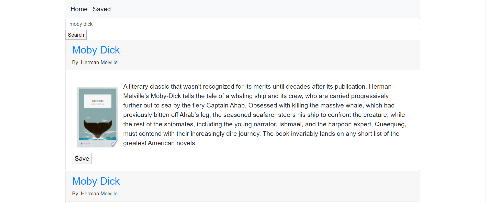

# Memory Game

## Purpose

A simple tool to search for and save books to using the google books api.

## Instructions

Search for a book using the search box, the results will appear below. You can then save them using the save button. Then you can navigate to the saved page to see all the books you have saved.

## Images

## Author

Evan Jones

## Technologies Used

React, MongoDB

## Contact

evanjones@fastmail.net
